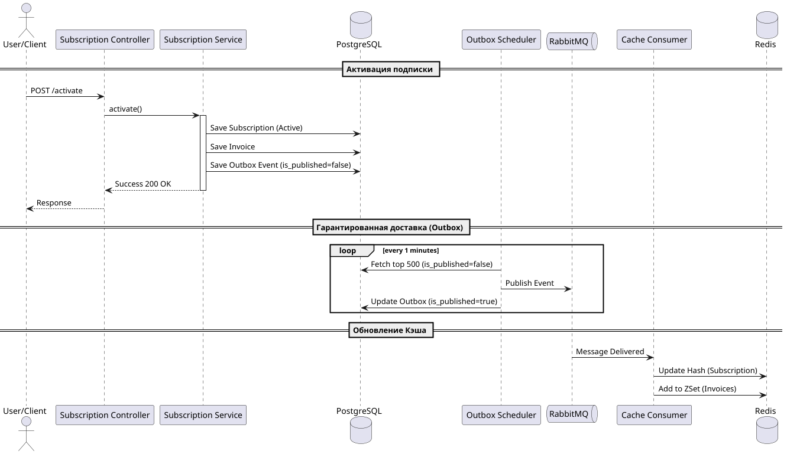
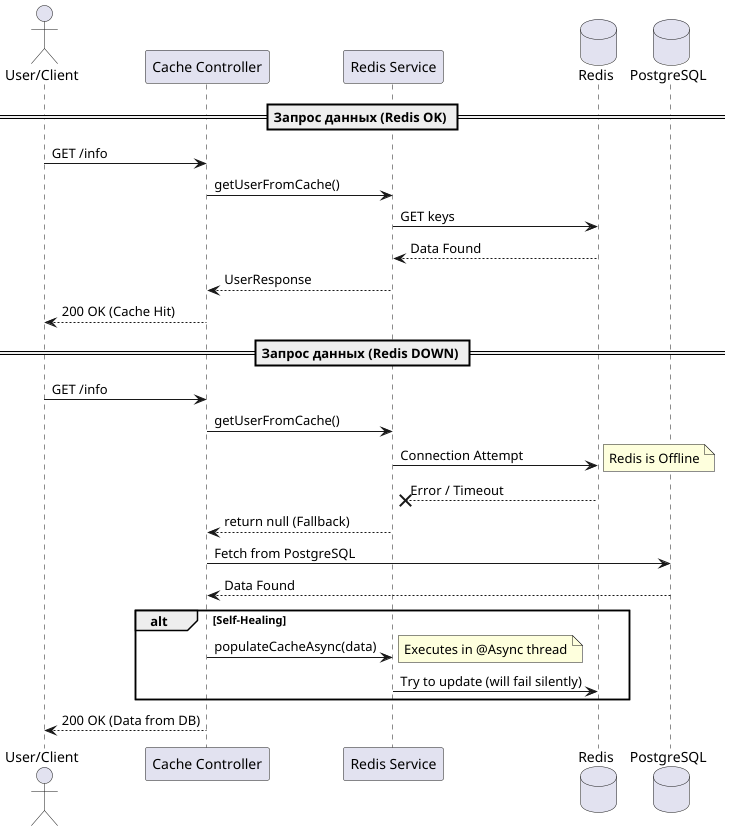

# Subscription Management System (SMS)

Система управления подписками, построенная на принципах Event-Driven Architecture и High Availability. Проект демонстрирует реализацию отказоустойчивых распределенных систем с использованием паттерна Transactional Outbox и многоуровневого кэширования.

## Ключевые архитектурные решения

### 1. Гарантированная доставка событий (Transactional Outbox)

    Чтобы исключить потерю данных при сбое брокера сообщений, реализован паттерн Outbox. 
    Изменения в БД и сохранение события в таблицу outbox происходят в одной ACID-транзакции. 
    Отдельный сервис OutboxScheduler с использованием Propagation.REQUIRES_NEW изолированно 
    отправляет сообщения в RabbitMQ, гарантируя доставку «At-least-once».

### 2. Отказоустойчивый кэш (Resilience & Fallback)
        
    Модуль кэширования спроектирован так, чтобы система оставалась работоспособной при отказе NoSQL хранилища:
    #   Cache-Aside: Приложение сначала запрашивает данные в Redis.
    #   Fallback: При недоступности Redis (Connection Timeout/Error) срабатывает try-catch блок, 
        и данные прозрачно для пользователя запрашиваются из PostgreSQL.
    #   Self-Healing: При «промахе» кэша или после его восстановления данные из БД асинхронно 
        (@Async) прогревают Redis,восстанавливая актуальность.

### 3. Оптимизация под Highload (Batch Processing)
   
    Обработка миллионов подписок и событий не вызывает переполнения памяти (OOM):
    BillingScheduler использует Slice и пагинацию по 500 записей за итерацию.
    Использование JOIN FETCH в репозиториях решает проблему N+1 и исключает LazyInitializationException в фоновых задачах.
    Redis Data Structure: Статус хранится в Hash (O(1)), а история счетов в Sorted Set, что позволяет делать нативную пагинацию средствами Redis.

## Технологический стек
    Java 21 / Spring Boot 3.5.6
    PostgreSQL (Source of Truth)
    Redis (High-speed Cache)
    RabbitMQ (Message Broker)
    Liquibase (Database Migrations)
    JUnit 5 + Mockito (Unit Testing)
    Testcontainers (Integration Testing)
    Docker & Docker Compose

## Техническая документация и System Design

### 1. Архитектурная схема (Sequence Diagram)

В системе реализовано слабое связывание модулей через брокер сообщений. 
Это позволяет сервису подписок работать максимально быстро, делегируя обновление кэша асинхронному потребителю.
   
### Сценарий: Активация и Биллинг

###  2. Стратегия отказоустойчивости (Resilience)

Система спроектирована для работы в условиях частичного отказа инфраструктуры (Fault Tolerance).
   
### Сценарий: Redis Offline (Fallback & Self-Healing)

### 3. Модель данных NoSQL (Redis Schema)
   
Для обеспечения пагинации и быстрого доступа к статусу, данные в Redis разделены на два типа ключей:

| Ключ                   | Тип                                                        |   Описание    |   Логика обновления   |
|:-----------------------|:-----------------------------------------------------------| :--- | :--- |
| user:{id}:subscription | Hash                                                       | Поле subscription содержит JSON текущего статуса  |   Перезаписывается при каждом изменении (Activation/Invoice). Удаляется при Deactivation  |
| user:{id}:invoices     | Sorted Set                                                 | Хранит JSON счетов. Score = timestamp   |   Только добавление (ZADD). Позволяет делать ZREVRANGE для пагинации (новые сверху)   |

## Гарантии и ограничения

Гарантия доставки (At-least-once): 
    
    Благодаря Transactional Outbox, события гарантированно попадут в RabbitMQ. 
    В случае сбоя БД после отправки, возможны дубликаты, которые корректно обрабатываются идемпотентными хендлерами кэша.

Консистентность (Eventual Consistency): 

    Данные в Redis обновляются с небольшой задержкой (обычно < 100мс), 
    что является допустимым компромиссом для обеспечения высокой доступности (High Availability).

Изоляция транзакций: 

    Каждый инвойс в BillingScheduler обрабатывается в отдельной транзакции (REQUIRES_NEW), 
    что исключает влияние ошибки одного пользователя на весь процесс биллинга

## Запуск проекта

### 1. Поднятие инфраструктуры
    
docker-compose up -d

Будут запущены: Postgres, RabbitMQ, Redis, а также инструменты мониторинга pgAdmin, Redis Commander и RabbitMQ Management.

### 2. Запуск приложения

mvn spring-boot:run

### 3. Тестирование (JUnit 5 + Mockito + Testcontainers)
   
Проект покрыт тестами. Для запуска интеграционных тестов необходим запущенный Docker.
   
mvn test

## API Endpoints

Subscription Service

    POST /api/v1/subscriptions/activate — Активация подписки (биллинг в день активации).
    POST /api/v1/subscriptions/deactivate — Отключение (история счетов сохраняется).

Cache Service

    GET /api/v1/users/{userId}/info?page=0&size=10 — Получение профиля пользователя (из Redis или Fallback в DB).

Модели данных в Redis

    Ключ user:{id}:subscription: тип Hash. Поле subscription содержит JSON активной подписки.
    Ключ user:{id}:invoices: тип Sorted Set. Элементы — JSON счетов, Score — timestamp для сортировки от новых к старым.